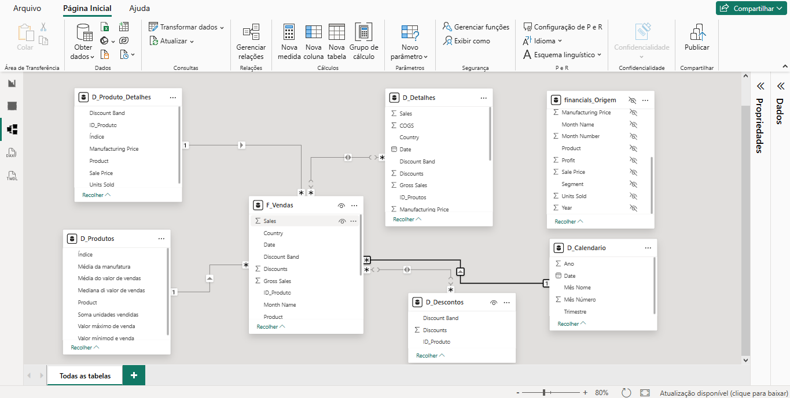

📊 Desafio de Projeto: Processamento de Dados com Power BI
Este projeto consistiu na estruturação de um modelo de dados em Star Schema (Esquema Estrela) a partir de uma base de dados bruta ("Financial Sample"). O objetivo foi otimizar a performance do relatório e facilitar a criação de medidas analíticas.

🛠️ Etapas do Projeto
Transformação de Dados: Realizei a limpeza e o agrupamento dos dados originais para criar tabelas de dimensão específicas como D_Produtos e D_Descontos.

Modelagem Star Schema: Estruturei o relacionamento entre a tabela fato (F_Vendas) e as dimensões, garantindo a integridade referencial.

Inteligência de Tempo (DAX): Implementei uma tabela de calendário (D_Calendario) utilizando funções DAX para permitir análises temporais por Ano, Mês e Trimestre.

📉 Funções DAX Utilizadas
CALENDAR(): Para gerar o intervalo automático de datas baseado na tabela fato.

ADDCOLUMNS(): Para criar colunas calculadas de Ano, Mês e Trimestre diretamente na tabela de dimensão.

FORMAT(): Utilizada para padronizar a exibição dos nomes dos meses e dias da semana.
